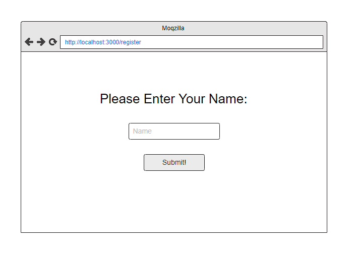
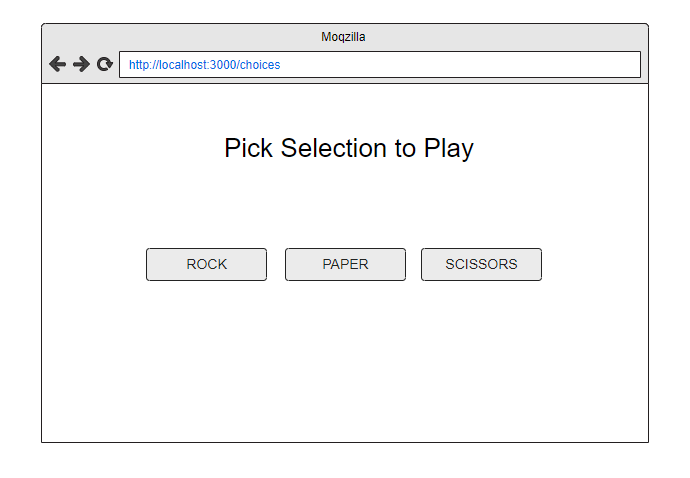
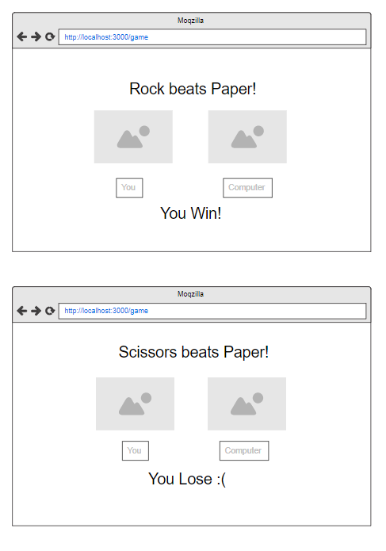
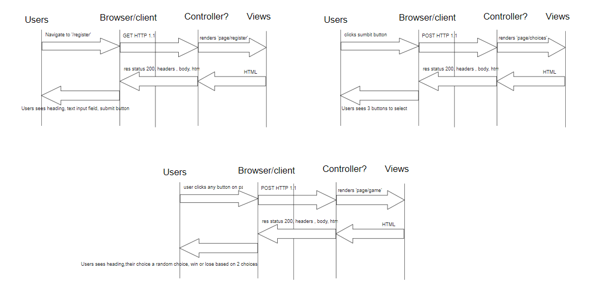
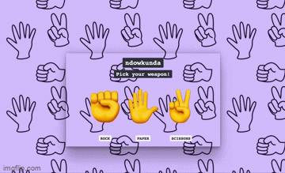
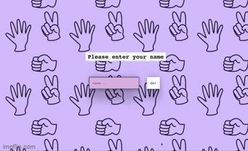
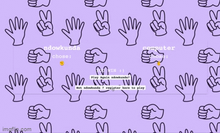
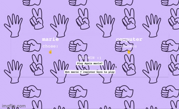

# Rock Paper Scissors Challenge

## About

This project will be a Rock, Paper, Scissors game hosted on a local server to demostrate understanding of how the web works and the MVC pattern

## Built With

### frameworks

-[Jasmine](https://github.com/twbs/bootstrap) -[Express](http://expressjs.com/) -[ejs](https://ejs.co/#install) -[Bootstrap](https://github.com/twbs/bootstrap)

## Getting Started

### Prerequisites

to install dependencies

```

npm install --save-dev express cypress ejs

```

To open local server host

```
node app.js
```

## Problem Approach

1. Mockups for user interactions
   
   
   

2. process model for user interactions
   

3. Domain model for JS classes

| Objects       | Properties        | Messages      | Context                   |
| ------------- | ----------------- | ------------- | ------------------------- | ----------------- | -------------- |
| Options       | rock              |               |                           | rock@str          |
| Options       | paper             |               |                           | paper@str         |
| Options       | scissors          |               |                           | scissors@str      |
| ---------     | -------------     | ---------     | ---------                 | ---------         |
| Player        | username          |               |                           |                   | username@str   |
| Player        | weapon            |               |                           |                   | weapon@emoji   |
| WeaponChoices | rock@emoji        |               |                           |                   | rock@emoji     |
| WeaponChoices | paper@emoji       |               |                           |                   | paper@emoji    |
| WeaponChoices | scissors@emoji    |               |                           |                   | scissors@emoji |
| ---------     | -------------     | ---------     | ---------                 | ---------         |
| Computer      | weaponChoices@obj | getWeapon()   | returns a random weapon   |                   | weapon@emoji   |
| ---------     | -------------     | ---------     | ---------                 | ---------         |
| Game          | weapons@array     |               |                           |                   | weapons@array  |
| Game          |                   | addWeapon()   |                           |                   | weapons@array  |
| Game          |                   | checkWeapon() | if choice2 beats choice1  | Player loses @str |
| Game          |                   | checkWeapon() | if choice1 beats choice2  | Player wins @str  |
| Game          |                   | checkWeapon() | if choice1 equals choice2 | draw@str          |

### tests

This project used cypress for its feature tests and jasmine for its unit tests

## Usage

### User Interactions

Demo of registering name to play

Demo of current player picking a weapon  

Demo of result of game vs computer

Demo of playing again via redirect links


## Acknowledgements

-
